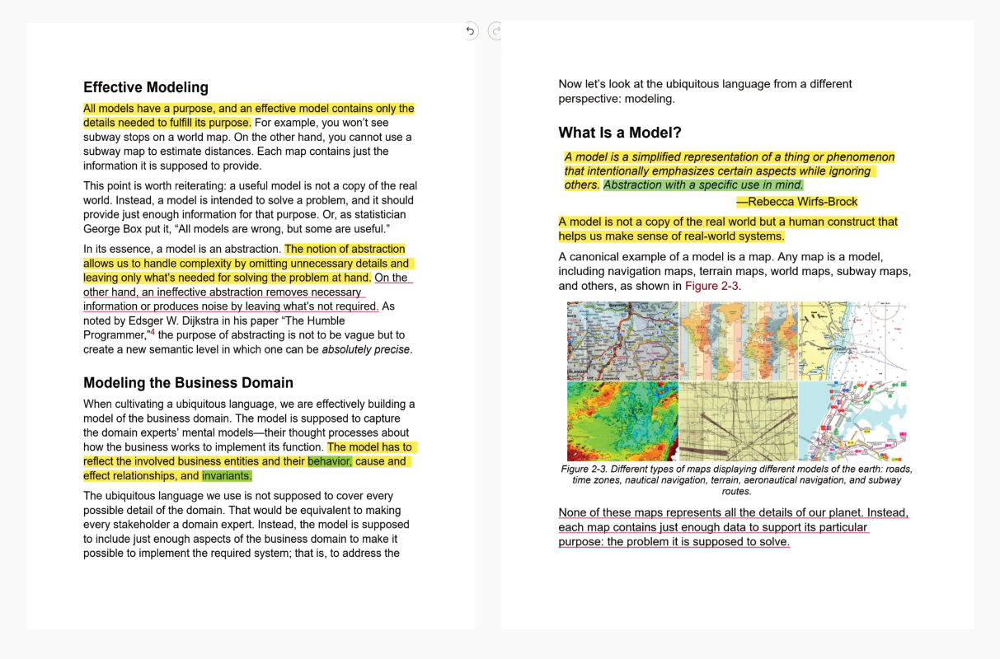

# Domain Driven Design in Go
Hi there!, this is a concise demonstration i am developing to instruct my friend Alex on the implementation of Domain-Driven Design (DDD) in Golang.


## What is Domain Driven Design?
Domain-Driven Design is a methodological philosophy that emphasizes a comprehensive understanding of the business domain prior to commencing the coding process. This approach ensures that the resulting code is semantically meaningful, maintainable, and extensible.

DDD bifurcates the software development process into two primary aspects: Strategic Design and Tactical Design. The Strategic Design phase involves thorough research, identification of domain-specific business rules, and the cultivation of a ubiquitous language that resonates across the domain.

The Tactical Design phase introduces a suite of patterns that guides the code-writing process, such as Value Objects, Repositories, Vertical Slicing, Criteria, Bounded Contexts, and Aggregates, among others.




## Why Golang?
As a seasoned developer with extensive experience across various programming languages-including Typescript, Python, Dart, Kotlin, Java, C++, C#, Rust, Go, Gleam and more—I firmly believe in mastering foundational principles and selecting the optimal tool for the task at hand.

Golang excels in simplicity and development velocity. However, there are several other attributes of Go that I find particularly compelling:

**Error as Value**: This philosophy integrates error handling as a fundamental part of code logic.

**Compilation to a Simple Binary**: Go compiles code into a single, self-contained binary, eliminating the need for runtime installations or virtual machines, thereby simplifying deployment.

**Robust Concurrency Model**: Go’s concurrency model is invaluable, especially when implementing Event-Driven Architectures that require concurrent execution of multiple Event Listeners in response to Domain Events.

**Built-in Testing Support**: Go includes native support for testing, allowing developers to write tests without requiring additional packages. Although I enhance the testing experience with supplementary packages for matchers, assertions, and more aesthetically pleasing test output.

**Efficient Memory Consumption**: Go’s efficient memory usage leads to cost-effective solutions, as it allows the execution of multiple containers, each running a Go project, with minimal resource overhead.

**Additional Features**: Go also offers Zero Values, ergonomic Object-Oriented Programming, implicit interfaces, and embedded interfaces, among other advantages.


## Project Structure
```bash
User/
├── Application/
│   └── UserRegister/
│       └── UserRegister.go
├── Domain/
│   ├── UserEmail/
│   │   └── UserEmail.go
│   ├── UserName/
│   │   └── UserName.go
│   └── User/
│       ├── User.go
│       └── UserRepository.go
└── Infrastructure/
    └── InMemory/
        └── InMemoryUserRepository.go
go.mod
main.go
practice.md
README.md
```

## Work in progress
- [ ] Add Docker configuration
- [ ] Integrate Testify for Test Assertions
- [ ] Add Http server & controllers
- [ ] Implement a data persistence layer
- [ ] Implement an application service for updating user email
- [ ] Add code documentation for each application service
- [ ] Create a seed script to populate the database with fictitious data, potentially generated using GPT or Claude, document everything in a Jupyter notebook with Python.
- [ ] Incorporate Information on Code Patterns: Value Objects, Repository Pattern, Clean Code, Domain Business Rules, Quotes from Learning Domain Driven Design, Vertical Slicing, Quotes from Essential Skills from the Agile Developer.

